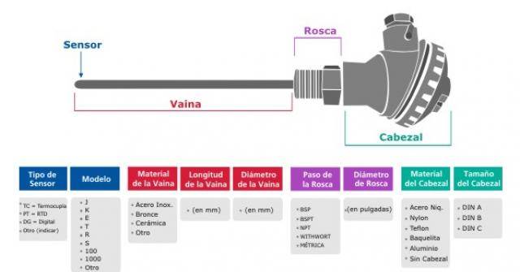

# Laboratorio II: Diseño de un sistema de adquisición de datos
## Taller de Instrumentación - Tecnológico de Costa Rica
### Sede Alajuela, Segundo Semestre 2023
### Profesor: Kaleb Alfaro Badilla

---

## Portada

**Tecnológico de Costa Rica**
*Escuela de Electrónica*
*Curso: EL-5822 Taller de Instrumentación*
*Sede: Alajuela*
*Segundo Semestre, 2023*

---

### Realizado por:

- Alexander Castro 2017153854
- Andrés Carrillo 2017106733
- Douglas Kopper 2017220194
- Steven Arias 2017097670

---

# Parte I: Solución del Cuestionario Previo

## Pregunta 1:
¿Cuales son los tipos de sensores de temperatura más populares? ¿Cuáles son sus ventajas y desventajas en función de los requisitos del diseño?

###Respuesta:
Respuesta.

## Pregunta 2:
¿Cuales son los tipos de termocuplas? ¿Cuales son sus rangos de temperatura y tensión?

###Respuesta:
Las termocuplas son sensores de temperatura que funcionan en base al principio de que cuando dos metales diferentes se unen en un extremo y se exponen a una diferencia de temperatura, se genera una diferencia de potencial (fuerza electromotriz) en el otro extremo de la termocupla. Existen varios tipos de termocuplas, designados por letras y combinaciones de metales que las componen.

**Algunos Tipos de Termocuplas Comunes**
1. - Tipo K (Cromel-Alumel):
   - Rango de Temperatura: Aproximadamente -270°C a 1372°C (-454°F a 2502°F).
   - Tensión Generada: Alrededor de 41 μV/°C.
2. - Tipo J (Hierro-Constantán):
   - Rango de Temperatura: Aproximadamente -210°C a 1200°C (-346°F a 2192°F).
   - Tensión Generada: Alrededor de 52 μV/°C.
3. - Tipo T (Cobre-Constantán):
   - Rango de Temperatura: Aproximadamente -270°C a 400°C (-454°F a 752°F).
   - Tensión Generada: Alrededor de 43 μV/°C.
4. - Tipo E (Cromel-Constantán):
   - Rango de Temperatura: Aproximadamente -270°C a 1000°C (-454°F a 1832°F).
   - Tensión Generada: Alrededor de 68 μV/°C.
5. - Tipo N (Nicrosil-Nisil):
   - Rango de Temperatura: Aproximadamente -270°C a 1300°C (-454°F a 2372°F).
   - Tensión Generada: Alrededor de 39 μV/°C.
6. - Tipo B (Platino-Rodio/Platino):
   - Rango de Temperatura: Aproximadamente 0°C a 1820°C (32°F a 3308°F).
   - Tensión Generada: Varía, alrededor de 10 μV/°C a 25 μV/°C.

**Notas sobre Rangos y Tensiones**
- Los rangos de temperatura y las tensiones generadas pueden variar ligeramente según las fuentes y las normas específicas utilizadas en la industria.
- Las termocuplas son adecuadas para diferentes aplicaciones en función de sus rangos de temperatura y sus propiedades específicas. La elección de la termocupla adecuada depende de los requisitos del diseño y el entorno de operación.
- Las tensiones generadas por las termocuplas son pequeñas y requieren amplificación para su lectura precisa.

## Pregunta 3:
¿Pregunta?

###Respuesta:
Respuesta.

## Pregunta 4:
¿Qué es el aislamiento eléctrico entre dos tierras? ¿En los diseños electrónicos que ventajas tiene el aislamiento entre señales?

###Respuesta:
El aislamiento eléctrico entre dos tierras se refiere a la práctica de separar dos partes de un sistema eléctrico o electrónico para evitar que las corrientes eléctricas fluyan entre ellas. Se logra utilizando materiales aislantes o dispositivos como transformadores o optoacopladores para evitar la conexión directa de las tierras.

**Ventajas del Aislamiento entre Señales en Diseños Electrónicos**
    1. **Prevención de Corrientes Parásitas:** El aislamiento evita la circulación de corrientes parásitas o fugas eléctricas entre diferentes partes del sistema. Esto es especialmente útil en circuitos sensibles o de alta impedancia.
    2. **Eliminación de Bucles de Tierra:** Los bucles de tierra pueden generar ruido y interferencias en los circuitos. El aislamiento entre señales evita la formación de bucles de tierra, mejorando la integridad de la señal.
    3. **Protección contra Descargas y Sobretensiones:** En sistemas donde puede haber diferencias de potencial significativas, el aislamiento protege contra descargas eléctricas y sobretensiones que podrían dañar componentes.
    4. **Mejora del Aislamiento Galvánico:** En sistemas que requieren aislamiento galvánico (aislamiento entre partes con diferentes potenciales), el aislamiento eléctrico asegura que no se establezcan conexiones conductivas no deseadas.
    5. **Reducción de Ruido y Interferencias:** El aislamiento minimiza la transferencia de ruido electromagnético entre circuitos, lo que mejora la calidad de las señales y la precisión de las mediciones.
    6. **Compatibilidad de Potencia:** Permite la interconexión de componentes o sistemas con diferentes niveles de potencia sin el riesgo de cortocircuitos.
    7. **Seguridad:** En sistemas donde hay interacción con usuarios, el aislamiento eléctrico puede mejorar la seguridad al evitar el riesgo de descargas eléctricas.

## Pregunta 5:
¿Pregunta?

###Respuesta:
Respuesta.

## Pregunta 6:
¿Pregunta?

###Respuesta:
Respuesta.

## Pregunta 7:
¿Pregunta?

###Respuesta:
Respuesta.

---

# Bibliografía

1. National Institute of Standards and Technology (NIST). "Thermocouples Calibrations Services". [Enlace a la fuente](https://www.nist.gov/pml/sensor-science/thermodynamic-metrology/thermocouples-calibrations-services).
2. Referencia2.
3. Ref3.
4. Texas Instruments. "Isolation: Understanding Signal and Power Isolation in Digital Systems". [Enlace de la fuente] (https://www.ti.com/lit/an/slla197/slla197.pdf)
5. Referencia5.
6. Referencia6.
7. Referencia7.

---
